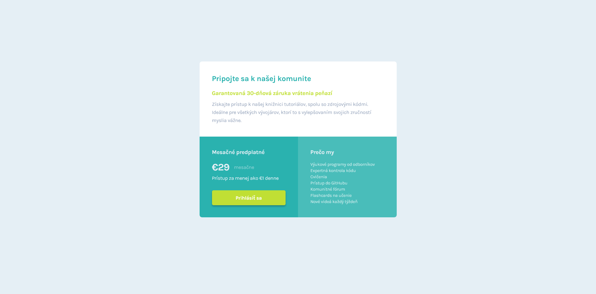

# Frontend Mentor - Single price grid component

## 📝 Informácie o projekte

Tento projekt je zo stránky Frontend Mentor ([Single price grid component](https://www.frontendmentor.io/challenges/single-price-grid-component-5ce41129d0ff452fec5abbbc)). Projekty zo stránky Frontend Mentor pomáhajú zlepošovať "coding skills" na realistických projektoch. Predlohy projektov sú dostupné na Figme. Anglické texty som upravil na slovenské.

## 🏗️ Vytvorenie projektu

Tento projekt som vytvoril pomocou HTML, CSS a SCSS. Snažil som sa precvičiť si SCSS, tak som ho používal aj v prípadoch, kedy to nebolo úplne potrebné.

#### [Odkaz na hotovu stránku](https://tomasdunik.github.io/frontend-mentor__single-price-grid-component/)

## 📸 Screenshots

### 💻 Desktop

### 📱 Mobil

## 🔗 Odkazy

- [Môj projekt na stránke Frontend Mentor](https://www.frontendmentor.io/solutions/my-version-single-price-grid-component-wRggEtnP0e)
- [Moje ostatné projekty na stránke Frontend Mentor](https://www.frontendmentor.io/profile/WeekendsProgrammer)
